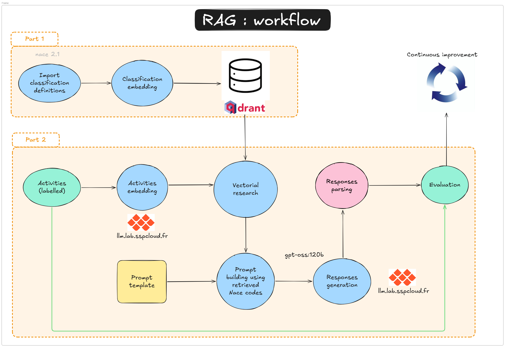
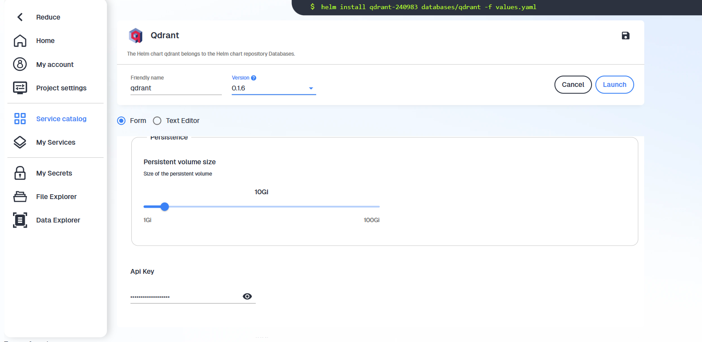

```{=html}
<table>
  <thead>
    <tr>
      <th>Technical level</th>
      <th>Tasks</th>
    </tr>
  </thead>
  <tbody>
    <tr>
      <td><span class="level-button level-beginner">Beginner</span></td>
      <td>Follow the tutorial and understand given answers.</td>
    </tr>
    <tr>
      <td><span class="level-button level-intermediate">Intermediate</span></td>
      <td>Try to complete the tutorial without checking answers.</td>
    </tr>
    <tr>
      <td><span class="level-button level-expert">Expert</span></td>
      <td>Enhance the pipeline and improve results (better models, better embedding strategy, .etc.).</td>
    </tr>
  </tbody>
</table>
```

# What is a RAG ? Why using a RAG ?



__TO COMPLETE__

# What are we about to learn ?

__TO COMPLETE__

# Technical requirements for this tutorial

- Connection to :
  - A Qdrant vectorial database 
  - __llm.lab__: The SSPCloud's LLM provider (Ollama/OpenWebUI)

## Environment variables and secrets

To connect your SSPCloud VSCode service to __Qdrant__ and __llm.lab__, you will need the folowing credentials.

```txt
QDRANT_URL=https://YOURNAMESPACE-qdrant.user.lab.sspcloud.fr/
QDRANT_API_KEY=xxxxxxxxxxxxxxxxxxxxxxxx
QDRANT_API_PORT=443
LLMLAB_API_KEY=xxxxxxxxxxxxxxxxxxxxxx
LLMLAB_URL=https://llm.lab.sspcloud.fr/api
```

Make sure to never leak thoses credentials!
They will need to be stored as an Onyxia Secret, or alternatively in a __.env file__.
Let's dive in with the second possibility.

## Where to get thoses creds ?

### For llm.lab

Please verify you are connected to the SSPCloud and then use the following link to reach __llm.lab__ UI : https://llm.lab.sspcloud.fr/.
Now, go to your account settings (upper right - "Réglages") / account ("Compte") / API Keys ("Clés d'API") => you are now ready to create your api key!


You can now fill your LLMLAB_API_KEY variable.

### For Qdrant

__TO COMPLETE__ : Shared qdrant or 1 Qdrant per namespace ?

- Create a Qdrant service __in your personal namespace__ as follows


- Copy and save properly your Qdrant token



- Launch you Qdrant service

## How to pass them as environment variables

- 1. Create an empty __.env__ file (at your repo's root)
- 2. Write your environment variables as above, and save
- 3. Use the folowing code to export theses variables to your environment variables


```python
from dotenv import load_dotenv
load_dotenv()
```


- 4. Verify all is good:

```python
import os
try:
    QDRANT_URL = os.environ["QDRANT_URL"]
    print(f"All right with QDRANT_URL secret")
except KeyError:
    raise ValueError("QDRANT_URL environment variable not set")
```


::: {.callout-warning appearance="simple"}

## Attention

Do not leak your secrets => Do not commit your .env file!

(use your .gitignore config do deal with it)

:::
