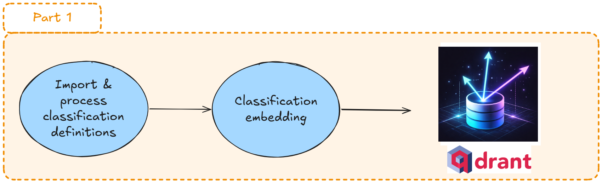
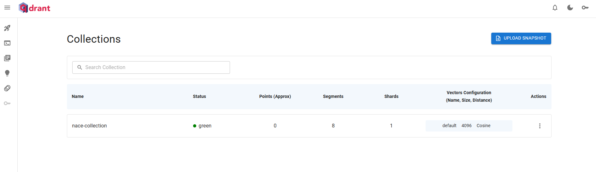
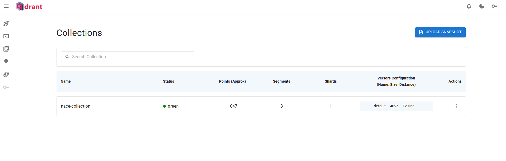

# Forewords

This first part will show you how to build a vector database, i.e., the "augmented" knowledge aimed to guide your LLM's responses.

The simplified workflow will be as follows:

- 0. Create a proper working environment with all needed connections (__s3:__ object storage, __qdrant:__ vector database and __llm.lab:__ LLM provider)
- 1. Take the NACE2.1 code definitions (code + title, + inclusions + exclusions in plain text)
- 2. Concatenate these pieces of information for each unique NACE (one code => 1 text)
- 3. Embed all these texts (1 text => 1 vector point)
- 4. Upload the points to Qdrant (the vector database service)


```
Raw Data → Clean Documents → Embeddings → Vector DB (Qdrant)
```



# Prepare your environment


::: {.callout-tip collapse="false" icon=false}
## `<i class="bi bi-book"></i>`{=html} Exercise 1: Connections

### Question 0

- Load your secrets stored in the `.env` file into your environment.


```{python}
#| label: dotenv
#| code-fold: true
#| code-summary: Click to see the answer
#| code-overflow: scroll

import os
from dotenv import load_dotenv

load_dotenv()
```


### Question 1


- Create your __llm.lab__ connection using `openai` client. Please name this client `client_llmlab`.

You will need to use your creds `os.environ["LLMLAB_URL"]` and `os.environ["LLMLAB_API_KEY"]` (see the previous chapter).

More information [here](https://github.com/openai/openai-python) about `OpenAI API`.

### Question 2

- Print all the available models (kindly made available to everyone by the SSPcloud team ❤️)

You can notice the `llm.lab` platform provides both __generation__ and __embedding__ models.

::: {.callout-tip}
The OpenAI API provides a standard way to interact with language models for text generation and embeddings. Here, instead of OpenAI’s cloud, we connect to a remote Ollama server (the *famous* `llm.lab` from the even more famous `SSPCloud`), which hosts the models. The API interface stays the same, so you can generate text or create embeddings with calls like `.completions.create()` or `.embeddings.create()` while all computation happens on the Ollama server.
:::

```{python}
#| label: client_llmlab
#| code-fold: true
#| code-summary: Click to see the answer
#| code-overflow: scroll
#| output: true

from openai import OpenAI

client_llmlab = OpenAI(
    base_url=os.environ["LLMLAB_URL"],
    api_key=os.environ["LLMLAB_API_KEY"],
)

# Print models list
models = client_llmlab.models.list()
for model in models.data:
    print(f"ID: {model.id}")

```

### Question 3

- Create a connection to your Qdrant server. Please name it `client_qdrant`.
- Check all your existing collections (= databases). Probably not a single one for now.

Find the documentation [here](https://python-client.qdrant.tech/) to dive deeper 😉.


```{python}
#| label: client_qdrant
#| code-fold: true
#| code-summary: Click to see the answer
#| code-overflow: scroll

from qdrant_client import QdrantClient

client_qdrant = QdrantClient(
    url=os.environ["QDRANT_URL"],
    api_key=os.environ["QDRANT_API_KEY"],
    port=os.environ["QDRANT_API_PORT"]
)

collections = client_qdrant.get_collections()
for collection in collections.collections:
    print(collection.name)

```
:::


# Get and process NACE data

Time to import our data: the official NACE2.1 definitions!

The data are stored in the s3 storage system of the SSPCloud platform (uploaded from [Eurostat](https://showvoc.op.europa.eu/#/datasets/ESTAT_Statistical_Classification_of_Economic_Activities_in_the_European_Community_Rev._2.1._%28NACE_2.1%29/downloads))

::: {.callout-tip collapse="false" icon=false}
## `<i class="bi bi-book"></i>`{=html} Exercise 2: handling NACE data

### Question 1

- Import NACE data (for example, as a list of dictionaries with the structure below)

```{python}
#| label: import-nace-data
#| code-fold: false
#| code-overflow: scroll
#| output: true

import duckdb
con = duckdb.connect(database=":memory:")

con.execute("INSTALL httpfs;")
con.execute("LOAD httpfs;")

path_nace = 'https://minio.lab.sspcloud.fr/projet-formation/diffusion/funathon/2026/project2/NACE_Rev2.1_Structure_Explanatory_Notes_EN.tsv'
query_definition = f"SELECT * FROM read_csv('{path_nace}')"
table = con.execute(query_definition).fetch_arrow_table()
nace = table.to_pylist()

nace[22]

```

### Question 2

- Build a class `NaceDocument` that will help you handle your NACE documents : 

    - Cleans features ('HEADING', 'Includes', etc.)
    - Checks your data (example: hierarchical coherence)
    - Creates a structured text for each code :
        - example: attribute `text`, created by a `to_embedding_text` method, 
        - this text will be ready to be embedded, 
        - It would be best to parametrize whether to include or not each possible field (e.g : text with or without "Excludes" feature). 

See an example of a cleaned and ready text for embedding: 

```markdown
# Code: 03.11
# Title: Marine fishing

## Includes:
This class includes:
- fishing on a commercial basis in ocean and coastal waters
- taking of marine crustaceans and molluscs
- whaling
- taking of marine aquatic animals (e.g. turtles, sea squirts, tunicates, sea urchins)

## Also includes:
This class also includes:
- gathering of other marine organisms and materials (e.g. natural pearls, sponges, coral, seaweed, algae)

## Excludes
This class excludes:
- frog farming, see 03.22\n
- operation of sport fishing preserves, see 93.19
```


```{python}
#| label: NaceDocument-class
#| code-fold: true
#| code-summary: Click to see the answer
#| code-overflow: scroll

from dataclasses import dataclass, field
from typing import Optional

def _clean(value) -> Optional[str]:
    """Normalize to stripped single-line string, or None if empty/missing."""
    if value is None:
        return None
    # str() handles non-string values (int, float...) from raw dicts
    # replace("\n", " ") flattens multiline strings to a single line
    # split() tokenizes on any whitespace, join(" ") rebuilds with single spaces
    cleaned = " ".join(str(value).replace("\n", " ").split())
    # Empty string is falsy in Python — return None instead for consistency
    return cleaned or None

@dataclass
class NaceDocument:
    code: str
    heading: str
    level: int
    parent_code: Optional[str] = None
    includes: Optional[str] = None
    includes_also: Optional[str] = None
    excludes: Optional[str] = None

    text: str = field(init=False)

    @classmethod
    def from_raw(cls, raw: dict, with_includes_also=True, with_excludes=False,) -> "NaceDocument":
        for key in ("CODE", "HEADING", "LEVEL"):
            if not raw.get(key):
                raise ValueError(f"Missing required field: {key}")

        level = int(raw["LEVEL"])
        if not (1 <= level <= 4):
            raise ValueError(f"Invalid level: {level}")

        obj = cls(
            code=str(raw["CODE"]).strip(),
            heading=_clean(raw["HEADING"]),
            level=level,
            parent_code=_clean(raw.get("PARENT_CODE")),
            includes=_clean(raw.get("Includes")),
            includes_also=_clean(raw.get("IncludesAlso")),
            excludes=_clean(raw.get("Excludes")),
        )

        obj.text = obj.to_embedding_text(
            with_includes_also=with_includes_also,
            with_excludes=with_excludes,
        )

        return obj

    def to_embedding_text(
        self,
        *,
        with_includes_also: bool = False,
        with_excludes: bool = False,
    ) -> str:
        parts = []

        parts.append(f"# Code: {self.code}")
        parts.append(f"# Title: {self.heading}")

        if self.includes:
            parts.append("")
            parts.append("## Includes:")
            parts.append(self.includes.strip())

        if with_includes_also and self.includes_also:
            parts.append("")
            parts.append("## Also includes:")
            parts.append(self.includes_also.strip())

        if with_excludes and self.excludes:
            parts.append("")
            parts.append("## Excludes:")
            parts.append(self.excludes.strip())

        output = "\n".join(parts)
        output = output.replace("\\n", "\n")

        return output.strip()

nace_documents = []
for nace_code in nace:
    nace_documents.append(
        NaceDocument.from_raw(
            raw=nace_code,
            with_includes_also=True, 
            with_excludes=True
        )
    )
    


```

### Question 3

- Create a text from a single Nace code example, with or without `Excludes` field


::: {style="max-height: 300px; overflow-y: auto;"}
```{python}
#| label: text-example
#| code-fold: true
#| code-summary: Click to see the answer
#| code-overflow: scroll
#| output: true


from pprint import pprint

i = 50
print(f"Printing index {i}:")

print("=============================================")
print("=============================================")

nace_example = nace[i]
doc_example = NaceDocument.from_raw(nace_example)

print("\nPrinting text to embed (WITH exclusions):")
_ = doc_example.to_embedding_text(
    with_includes_also=True,
    with_excludes=True,
)
print(doc_example.text)

print("=============================================")
print("=============================================")

print("\nPrinting text to embed (WITHOUT exclusions):")
_ = doc_example.to_embedding_text(
    with_includes_also=True,
    with_excludes=False,
)
print(doc_example.text)

```
:::
::::

# Embed your NACE text descriptions

Now let's choose an embedding model. We will use `qwen3-embedding-8b`, available on HuggingFace (like all other models provided by `llm.lab`).

For later use, we need to know the dimension of the vectors output by our model: 4096 (see the [model card](https://huggingface.co/Qwen/Qwen3-Embedding-8B) on HuggingFace).


```{python}

#| label: embedding_params

emb_model = "qwen3-embedding-8b"
emb_dim = 4096
```


::: {.callout-tip collapse="false" icon=false}
## `<i class="bi bi-book"></i>`{=html} Exercise 3: create a Qdrant vector store and feed it with embedded NACE text descriptions

### Question 1


- Use your `client_qdrant` and the method `create_collection` to create a new Qdrant collection (e.g: a new vector database). For example, call it __nace-collection__.

```{python}

#| label: create-collection
#| code-fold: true
#| code-summary: Click to see the answer
#| code-overflow: scroll

from qdrant_client.models import Distance, VectorParams

COLLECTION_NAME = "nace-collection-test"

# Delete the collection if necessary
if client_qdrant.collection_exists(collection_name=COLLECTION_NAME):
    client_qdrant.delete_collection(collection_name=COLLECTION_NAME)

# Create the collection
client_qdrant.create_collection(
    collection_name=COLLECTION_NAME,
    vectors_config=VectorParams(
        size=emb_dim,
        distance=Distance.COSINE
    )
)
```

So far, you should see your new empty collection from Qdrant's UI:



### Question 2

Use your `client_llmlab` and the method `.embeddings.create` to embed your NACE descriptions created earlier. 

- a) Update your `NaceDocument` class like previously:
    - Add a `get_embeddings` method (not called by the constructor) that generates an embedding vector for a `NaceDocument` instance.
    - The method stores the embeddings in a new `vector` attribute.
- b) Try it on a couple of NACE documents (not to launch 1,047 requests)
- c) Inspect your embedding vectors

```{python}
#| label: up-nacedocument-emb
#| code-fold: true
#| code-summary: Click to see the answer
#| code-overflow: scroll

from dataclasses import dataclass, field
from typing import Optional, List


@dataclass
class NaceDocument:
    code: str
    heading: str
    level: int
    parent_code: Optional[str] = None
    includes: Optional[str] = None
    includes_also: Optional[str] = None
    excludes: Optional[str] = None

    text: str = field(init=False)
    vector: Optional[List[float]] = field(default=None, init=False)

    @classmethod
    def from_raw(
        cls,
        raw: dict,
        with_includes_also=True,
        with_excludes=False,
    ) -> "NaceDocument":
        for key in ("CODE", "HEADING", "LEVEL"):
            if not raw.get(key):
                raise ValueError(f"Missing required field: {key}")

        level = int(raw["LEVEL"])
        if not (1 <= level <= 4):
            raise ValueError(f"Invalid level: {level}")

        obj = cls(
            code=str(raw["CODE"]).strip(),
            heading=_clean(raw["HEADING"]),
            level=level,
            parent_code=_clean(raw.get("PARENT_CODE")),
            includes=_clean(raw.get("Includes")),
            includes_also=_clean(raw.get("IncludesAlso")),
            excludes=_clean(raw.get("Excludes")),
        )

        obj.text = obj.to_embedding_text(
            with_includes_also=with_includes_also,
            with_excludes=with_excludes,
        )

        return obj

    def to_embedding_text(
        self,
        *,
        with_includes_also: bool = False,
        with_excludes: bool = False,
    ) -> str:
        parts = []

        parts.append(f"# Code: {self.code}")
        parts.append(f"# Title: {self.heading}")

        if self.includes:
            parts.append("")
            parts.append("## Includes:")
            parts.append(self.includes.strip())

        if with_includes_also and self.includes_also:
            parts.append("")
            parts.append("## Also includes:")
            parts.append(self.includes_also.strip())

        if with_excludes and self.excludes:
            parts.append("")
            parts.append("## Excludes:")
            parts.append(self.excludes.strip())

        output = "\n".join(parts)
        output = output.replace("\\n", "\n")

        return output.strip()

    def get_embeddings(
        self,
        client_llmlab,
        emb_model: str,
    ) -> List[float]:
        try:
            response = client_llmlab.embeddings.create(
                model=emb_model,
                input=self.text
            )

            self.vector = response.data[0].embedding
            return self.vector

        except Exception as e:
            raise RuntimeError(f"Embedding failed for doc {self.code}: {str(e)}")
```

```{python}
#| label: get-embeddings
#| code-fold: true
#| code-summary: Click to see the answer
#| code-overflow: scroll

# Recreate your NACE documents (that class has been updated)

sample_size = 10

nace_documents = []
for nace_code in nace[:sample_size]:
    nace_documents.append(
        NaceDocument.from_raw(
            raw=nace_code,
            with_includes_also=True, 
            with_excludes=True
        )
    )

for nace_doc in nace_documents:
    nace_doc.get_embeddings(
        client_llmlab,
        emb_model,
    )


```

### Question 3

- Inspect your embeddings

```{python}
#| label: check-embeddings
#| code-fold: true
#| code-summary: Click to see the answer
#| code-overflow: scroll
#| output: true

print("\nPrinting the first document:")
print(nace_documents[0])

print("\nPrinting the embedding vector of the first document:")
print(nace_documents[0].vector)

print(f"\nLength of this vector: {len(nace_documents[0].vector)}")

```

### Question 4

- Update once again your `NaceDocument` to create a new method to build a Qdrant `PointStruct` like dictionary (see [the PointStruct note](#pointstruct)). This structure is required by the Qdrant API.

```python

{
    "id": ..., # strictly standardized id 
    "vector": ..., # embedding_vector
    "payload": {
        "code": ...,
        "heading": ...,
        "level": ...,
        "parent_code": ...,
        "text": text, # to help inspection in Qdrant's UI
    },
}

```

```{python}
#| label: up-nacedocument-points
#| code-fold: true
#| code-summary: Click to see the answer
#| code-overflow: scroll


from dataclasses import dataclass, field
from typing import Optional, List
from uuid import uuid5, NAMESPACE_DNS
from qdrant_client.models import PointStruct

NACE_NAMESPACE = uuid5(NAMESPACE_DNS, "nace-rev2")

@dataclass
class NaceDocument:
    code: str
    heading: str
    level: int
    parent_code: Optional[str] = None
    includes: Optional[str] = None
    includes_also: Optional[str] = None
    excludes: Optional[str] = None

    text: str = field(init=False)
    vector: Optional[List[float]] = field(default=None, init=False)

    @classmethod
    def from_raw(
        cls,
        raw: dict,
        with_includes_also=True,
        with_excludes=False,
    ) -> "NaceDocument":
        for key in ("CODE", "HEADING", "LEVEL"):
            if not raw.get(key):
                raise ValueError(f"Missing required field: {key}")

        level = int(raw["LEVEL"])
        if not (1 <= level <= 4):
            raise ValueError(f"Invalid level: {level}")

        obj = cls(
            code=str(raw["CODE"]).strip(),
            heading=_clean(raw["HEADING"]),
            level=level,
            parent_code=_clean(raw.get("PARENT_CODE")),
            includes=_clean(raw.get("Includes")),
            includes_also=_clean(raw.get("IncludesAlso")),
            excludes=_clean(raw.get("Excludes")),
        )

        obj.text = obj.to_embedding_text(
            with_includes_also=with_includes_also,
            with_excludes=with_excludes,
        )

        return obj

    def to_embedding_text(
        self,
        *,
        with_includes_also: bool = False,
        with_excludes: bool = False,
    ) -> str:
        parts = []

        parts.append(f"# Code: {self.code}")
        parts.append(f"# Title: {self.heading}")

        if self.includes:
            parts.append("")
            parts.append("## Includes:")
            parts.append(self.includes.strip())

        if with_includes_also and self.includes_also:
            parts.append("")
            parts.append("## Also includes:")
            parts.append(self.includes_also.strip())

        if with_excludes and self.excludes:
            parts.append("")
            parts.append("## Excludes:")
            parts.append(self.excludes.strip())

        output = "\n".join(parts)
        output = output.replace("\\n", "\n")

        return output.strip()

    def get_embeddings(
        self,
        client_llmlab,
        emb_model: str,
    ) -> List[float]:
        try:
            response = client_llmlab.embeddings.create(
                model=emb_model,
                input=self.text
            )

            self.vector = response.data[0].embedding
            return self.vector

        except Exception as e:
            raise RuntimeError(f"Embedding failed for doc {self.code}: {str(e)}")

    def to_qdrant_point(
        self,
    ) -> PointStruct:

        if not hasattr(self, "vector") or self.vector is None:
            raise ValueError("vector is missing or Null")
        return PointStruct(
            # uuid5 is deterministic: same namespace + code always yields the same UUID
            # stable across runs, valid for Qdrant, no hacky string manipulation needed
            id=str(uuid5(NACE_NAMESPACE, self.code)),
            vector=self.vector,
            payload={
                "code": self.code,
                "level": self.level,
                "parent_code": self.parent_code,
                # Storing the text used for embedding enables inspection and debugging
                "text": self.text,
            }
        )


```

### Question 5

- Recreate your Nace documents, all your embeddings and generate all points (__PointStruct__). Please take a look at [this callout](#prodgrad) to get a sense of the limits of this approach with a view to production use.


```{python}

#| label: gen-all-points
#| code-fold: true
#| code-summary: Click to see the answer
#| code-overflow: scroll
#| output: true

sample_size = 10  # /!\ Do not use a sample (it's just to build the notebook)

nace_points = []

for nace_code in nace[:sample_size]:
    nace_doc = NaceDocument.from_raw(
        raw=nace_code,
        with_includes_also=True, 
        with_excludes=True
    )

    nace_doc.get_embeddings(
        client_llmlab,
        emb_model,
    )

    nace_points.append(
        nace_doc.to_qdrant_point()
    )


```

```{python}

#| label: check-point
#| code-fold: true
#| code-summary: Click to see the answer
#| code-overflow: scroll
#| output: true

print("\nCheck the first PointStruct:\n")
print(nace_points[0])

```

### Question 6

- Upload your points into your Qdrant collection, using `client_qdrant.upsert` method. Try to batch it.

```{python}

#| label: feed-qdrant
#| code-fold: true
#| code-summary: Click to see the answer
#| code-overflow: scroll
#| output: false

upload_batch_size = 10

for i in range(0, len(nace_points), upload_batch_size):
    batch = nace_points[i:i + upload_batch_size]
    try:
        client_qdrant.upsert(
            collection_name=COLLECTION_NAME,
            points=batch
        )
        print(f"Uploaded batch {i//upload_batch_size + 1}/{(len(nace_points)-1)//upload_batch_size + 1}")
    except Exception as e:
        print(f"Failed to upload batch {i//upload_batch_size + 1}: {str(e)}")
        continue

```

### Question 7

- Inspect your Qdrant collection. It should contain 1,047 vectors.



```{python}

#| label: check-collection
#| code-fold: true
#| code-summary: Click to see the answer
#| code-overflow: scroll
#| output: false

count = client_qdrant.count(collection_name=COLLECTION_NAME)
print(count)
```

:::

::: {.callout-note #pointstruct}

`PointStruct` is a Pydantic model provided by the qdrant_client library that represents a single vector database entry. 
It bundles together the three components Qdrant needs to store and query a point:

- a unique id,
- a vector (the embedding),
- and a payload (arbitrary metadata as a dict).

Passing raw dicts directly to the Qdrant API would require manual serialization and validation. PointStruct handles that for you and ensures the data is correctly typed before being sent to the server. It's essentially the contract between your Python code and the Qdrant collection.
:::

::: {.callout-important #prodgrad}

## Limitations of the teaching approach

Please note that this workflow is __not optimized at all__.

Here, we intentionally adopt a step-by-step approach to support learning. In a production-ready setup, however, the workflow would be batched and asynchronous, with embeddings fed into the Qdrant store as soon as they are generated.

Advanced users are welcome to give it a try.

Below, please find a non-exhaustive list of good practices for production-grade workflows : 

- __Batching__: Process multiple documents per request to reduce overhead and improve throughput.
- __Concurrency Limits__: Restrict the number of simultaneous requests to avoid overwhelming the server.
- __Retries__: Implement automatic retries for transient network failures or server timeouts.
- __Progressive Saves__: Save embeddings or processed points incrementally to avoid losing work in case of interruption.
- __Logging__: Record progress, errors, and metadata for monitoring and debugging.
- __Monitoring & Alerts__: Track performance metrics, request latency, and error rates.
- __Validation & Sanity Checks__: Ensure embeddings are generated correctly and vectors are valid before inserting into your vector store.
- __Resource Management__: Release memory and close connections appropriately to avoid leaks in long-running pipelines.
- __Idempotency__: Use deterministic IDs for points (e.g., uuid5) so retries or reprocessing don’t create duplicates.
- __Security & Secrets__: Keep API keys and sensitive data secure and never hardcode them in your code.

:::
